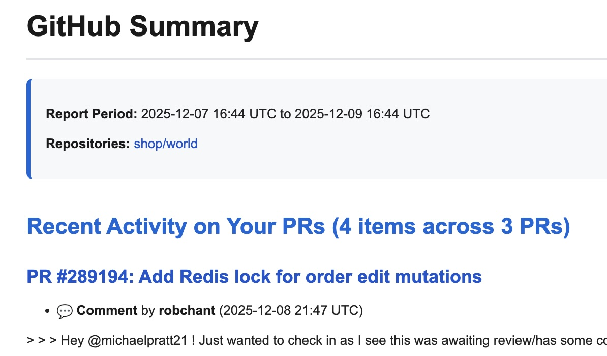
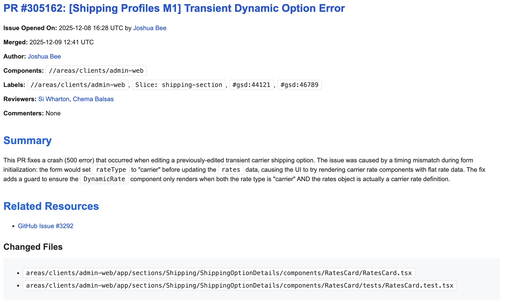

# GitHub Summary

AI-powered tool that generates human-readable summaries of merged GitHub PRs using Claude. Perfect for daily/weekly team updates, keeping stakeholders informed, or tracking project progress.

## Features

- 🤖 **AI-Powered Summaries**: Uses Claude to generate concise, context-aware summaries of each PR
- 📊 **Flexible Filtering**: Filter by labels, usernames, repositories, and time ranges
- 👤 **Personal Dashboard**: Track PRs awaiting your review and comments on your PRs
- 📧 **Multiple Output Options**: Send via email (HTML formatted), Slack, or save to files
- ⚡ **High-Volume Support**: Handles repositories with 700+ PRs/day
- ⏰ **Automation Ready**: Easy to schedule with cron jobs

## Quick Start

### 1. Clone and Setup (one-time)

```bash
git clone https://github.com/michaelpratt21/github-summary
cd github-summary

# Run setup script (creates venv and installs dependencies)
./setup.sh
```

### 2. Configure Environment Variables

```bash
# GitHub token (required) - Get with: gh auth token
export GITHUB_TOKEN="your-github-token"

# Anthropic API key (required; found on https://openai-proxy.shopify.io/dashboard/access)
export OPENAI_API_KEY="your-shopify-ai-proxy-token"

# Email settings (required if using --email for output)
export SMTP_USER="your.email@company.com"
export SMTP_PASSWORD="your-app-password"
export SMTP_FROM="your.email@company.com"
```

See [docs/EMAIL_SETUP.md](docs/EMAIL_SETUP.md) for detailed email setup instructions if you plan to get email summaries.

### 3. Usage

### Command Line

```bash
./run.sh [OPTIONS]

Options:
  --repos REPOS              Comma-separated list of repositories (owner/repo)
  --labels LABELS            Comma-separated list of GitHub labels to filter
  --usernames USERNAMES      Comma-separated list of GitHub usernames to filter
  --github-username USER     Your GitHub username (for PRs awaiting review & activity on your PRs)
  --time-range RANGE         Time range to look back (e.g., 24h, 7d)
  --email EMAIL              Email address to send summary (can be repeated)
  --slack URL                Slack webhook URL (can be repeated)
  --file PATH                Output file path (can be repeated)
  --config FILE              Path to YAML config file
```

**Note:** At least one output method (--email, --slack, or --file) is required.

### Configuration File

For repeated use, create a config file:

```bash
cp github_summary_config.yaml.example github_summary_config.yaml
# Edit with your settings
```

Then run:

```bash
./run.sh --config github_summary_config.yaml
```

### Examples

**Daily team summary:**
```bash
./run.sh --repos "shop/world" \
  --labels "Slice: delivery,Slice: fulfillment" \
  --time-range 24h \
  --email team@example.com
```

**Weekly report with multiple outputs:**
```bash
./run.sh --repos "org/repo1,org/repo2" \
  --time-range 7d \
  --email manager@example.com \
  --email team@example.com \
  --slack https://hooks.slack.com/services/YOUR/WEBHOOK/URL \
  --file weekly-report.md
```

**Track specific contributors:**
```bash
./run.sh --repos "org/repo" \
  --usernames "alice,bob,charlie" \
  --time-range 48h \
  --file contributors-report.md
```

**Personal dashboard (PRs awaiting your review + activity on your PRs):**
```bash
./run.sh --repos "org/repo" \
  --github-username "your-username" \
  --labels "Slice: your-team" \
  --time-range 24h \
  --email you@example.com
```

## Automation with Cron

Schedule automated daily reports:

```bash
# Edit crontab
crontab -e

# Add entries (see examples/crontab.example for full setup)
# Monday at 6am - 72h report (covers weekend)
0 6 * * 1 cd /path/to/github-summary && ./cron_wrapper.sh --config github_summary_config_3d.yaml

# Tuesday-Friday at 6am - 24h report
0 6 * * 2-5 cd /path/to/github-summary && ./cron_wrapper.sh --config github_summary_config.yaml
```

See [examples/crontab.example](examples/crontab.example) for complete cron setup.

## Report Sections

When you include the `github_username` option, your report will include these additional sections:

### PRs Awaiting Your Review
Lists open PRs where you are **directly** requested as a reviewer (not via team membership). Helps you stay on top of your review queue.

### Recent Activity on Your PRs
Shows comments and reviews from others on PRs you authored within the time range. Includes:
- 💬 Regular comments
- ✅ Approvals
- 🔄 Changes requested
- 📝 Review comments

Note: Bot comments are automatically filtered out.



### Merged PRs Summary
The main section showing AI-generated summaries of merged PRs matching your label/username filters.



## Output Formats

### Email (HTML)
- GitHub-styled formatting
- Clickable PR titles and file links
- Color-coded sections
- Monospace formatting for technical elements
- Mobile-friendly responsive design

### Slack
- Markdown formatting
- Automatic message splitting for long reports
- Preserves links and formatting

### File
- Clean markdown format
- Perfect for version control
- Easy to convert to other formats

## Project Structure

```
github-summary/
├── README.md                        # This file
├── QUICKSTART.md                    # 5-minute quick start guide
├── setup.sh                         # Setup script (creates venv, installs deps)
├── run.sh                           # Run script (activates venv automatically)
├── requirements.txt                 # Python dependencies
├── github_summary.py                # Main script
├── github_summary_config.yaml.example # Example configuration
├── docs/
│   └── EMAIL_SETUP.md              # Email setup guide
└── examples/
    └── crontab.example             # Cron job examples
```

## Requirements

- Python 3.8+
- GitHub CLI (`gh`) installed and authenticated
- Anthropic API access (via Shopify proxy or direct)
- SMTP credentials (if using email output)

### Installing GitHub CLI

Should already be installed if you use `dev` but if not:

```bash
# macOS
brew install gh

# Linux
# See https://github.com/cli/cli#installation

# Authenticate
gh auth login
```

## Troubleshooting

### "No repositories specified"
Make sure to provide `--repos` or use a config file with repositories defined.

### "At least one output method required"
You must specify at least one of: `--email`, `--slack`, or `--file`.

### "SMTP credentials not configured"
Set `SMTP_USER` and `SMTP_PASSWORD` environment variables. See [docs/EMAIL_SETUP.md](docs/EMAIL_SETUP.md).

### Email not received
- Check spam folder
- Verify SMTP credentials
- Check logs for error messages
- See [docs/EMAIL_SETUP.md](docs/EMAIL_SETUP.md) for detailed troubleshooting

### High volume repos timing out
The script automatically handles high-volume repositories by fetching PRs day-by-day. If you still have issues, try reducing the time range.

## Contributing

Issues and pull requests welcome!

## License

[Add your license here]
